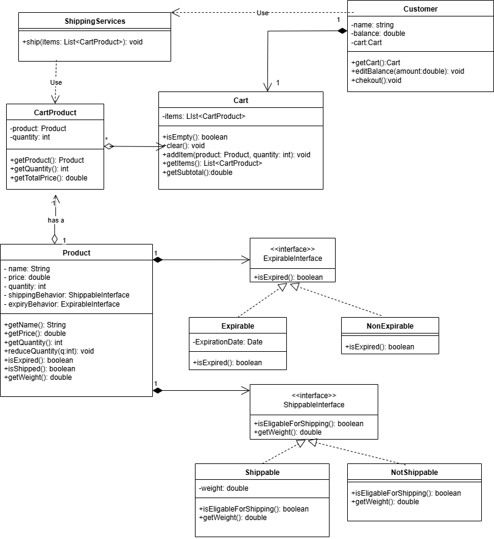

# E-Commerce Checkout System

This is a simple Java-based e-commerce checkout system that supports product management, cart operations, shipping calculation, and invoice generation.

---

## Features

- ✅ Add products with or without expiry dates
- ✅ Support both shippable and non-shippable products
- ✅ Calculate shipping fees based on product weight (5 EGP per kg)
- ✅ Prevent checkout if:
  - Product is expired
  - Product is out of stock
  - Customer has insufficient balance
  - Cart is empty
- ✅ Reduce product stock after checkout
- ✅ Show detailed shipping notice and customer receipt

---

## Project Structure
        src/
    ├── model/
    │ ├── Customer.java
    │ ├── Product.java
    │ ├── Cart.java
    │ ├── CartProduct.java
    ├── behavior/
    │ ├── ExpriableInterface.java
    │ ├── Expriable.java
    │ ├── NonExpriable.java
    │ ├── Shippableinterface.java
    │ ├── Shippable.java
    │ ├── NotShippable.java
    ├── service/
    │ └── ShippingService.java
    images/
    └── uml.png ← UML diagram image
    README.md

---

## How to Run

1. Clone this repo or download the source
2. Open it in **Visual Studio Code (blue one)** or any Java IDE
3. Ensure your `Main.java` contains:
   - Creating sample products
   - Creating a customer with balance
   - Adding items to the cart
   - Calling `checkout()` on the customer

---

## UML Class Diagram

  

  This UML diagram shows:
  - `Customer` has a `Cart`
  - `Cart` contains multiple `CartProduct`s
  - `CartProduct` references a `Product`
  - `ShippingService` is a utility class called during checkout

  ---

## Sample Output
    ** Shipment notice **
    2x Cheese 1500g
    1x TV 10000g
    Total package weight: 13.0kg

    ** Checkout receipt **
    2x Cheese 100
    1x TV 300
    1x Scratch Card 20
    ----------------------
    Subtotal 420
    Shipping 65
    Amount 485

---

## Package Naming

  - `model` → All core domain classes (Customer, Product, Cart, etc.)
  - `behavior` → Interfaces or abstract behaviors shared by products  
     (e.g. `Expirable`, `Shippable`)
  - `service` → Utility classes like `ShippingService`

---

## 👩‍💻 Author

Made with 💙 by **Yara Hazem**

---
